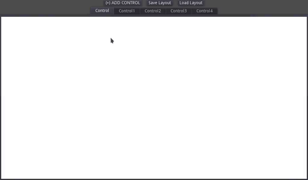
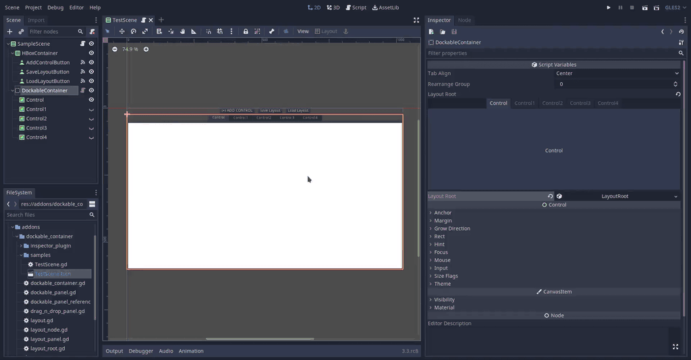

# Dockable Container

> **Warning**
>
> This branch is only usable with Godot 4.X.
> For Godot 3.X support, check out the [godot-3](https://github.com/gilzoide/godot-dockable-container/tree/godot-3) branch.

Docking/tiling UI panels Container addon for [Godot](https://godotengine.org/).

It is composed of a Container script and layout Resources in a binary tree
structure that store panels division direction and size as well as tab names
and what tab index is currently selected. As layout information are Resources,
it's easy to save/load them.

Child Controls are only moved visually and have their NodePaths and position in
parent maintained.

Available at the [Asset Library](https://godotengine.org/asset-library/asset/916).

Live preview a sample scene [here](https://gilzoide.github.io/godot-dockable-container/).

## Plugin
Enable `Dockable Container` plugin at `Project -> Project Settings -> Plugin`
to edit the layout directly in the inspector! It also registers the
`DockableContainer` node type.

## Theming
Panels are actual `TabContainer` instances, split handles use `VSplitContainer` and
`HSplitContainer` theme configurations, drop preview uses `TooltipPanel/panel` StyleBox.
Tabs alignment and rearrange group are exported in DockableContainer.

## TODO
- Add way to specify icon and custom name for tabs, based on a property or method on children
- Document better how to use

## Credits
Node icon made by [Nif-kun](https://github.com/Nif-kun). Licensed under [CC0](https://creativecommons.org/share-your-work/public-domain/cc0/).
